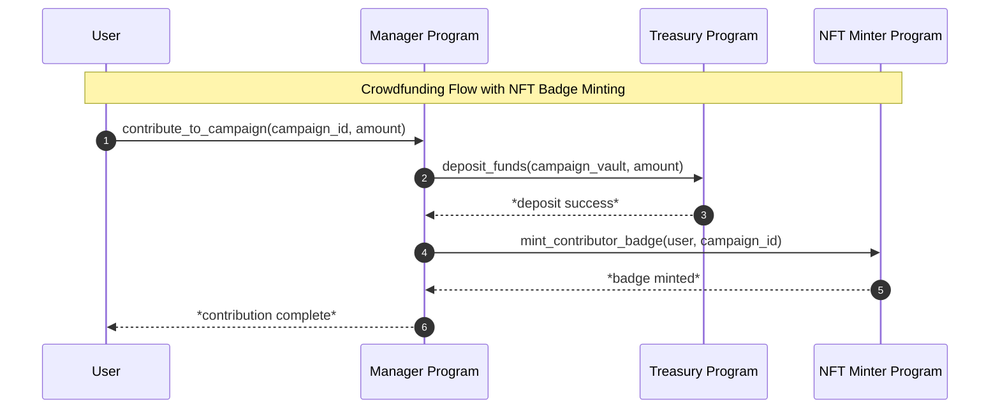
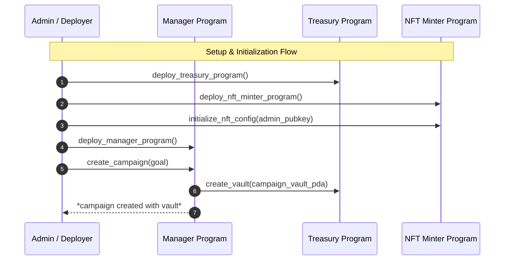

# Crowdfunding

### Use Case Overview

### How to Execute
1. `solana-test-validator`
2. `./build.sh`
3. `. ./deploy.sh`
4. `cargo run --bin setup_flow.rs`
5. Copy the `Campaign Account` value from the output
6. `cargo run --bin user_flow.rs <campaign_account>`