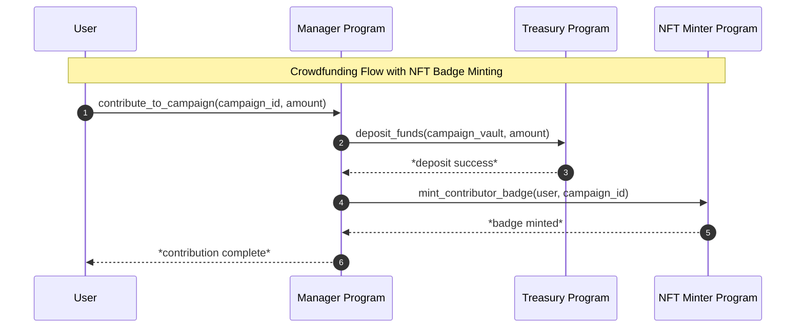
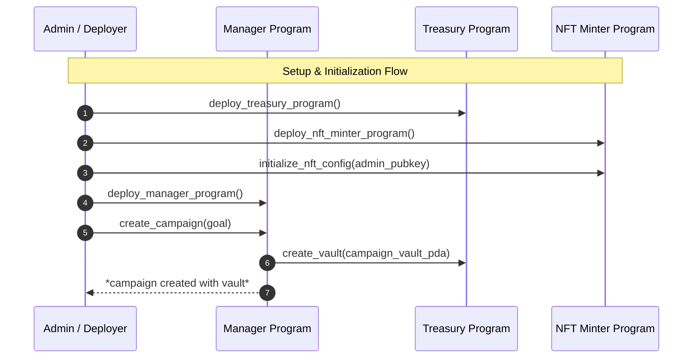

# Crowdfunding

```mermaid
sequenceDiagram
    autonumber
    participant User as User
    participant Manager as Manager Program
    participant Treasury as Treasury Program
    participant NFT as NFT Minter Program

    Note over User,NFT: Crowdfunding Flow with NFT Badge Minting

    User->>Manager: contribute_to_campaign(campaign_id, amount)
    Manager->>Treasury: deposit_funds(campaign_vault, amount)
    Treasury-->>Manager: *deposit success*
    Manager->>NFT: mint_contributor_badge(user, campaign_id)
    NFT-->>Manager: *badge minted*
    Manager-->>User: *contribution complete*
```

```mermaid
sequenceDiagram
    autonumber
    participant Admin as Admin / Deployer
    participant Manager as Manager Program
    participant Treasury as Treasury Program
    participant NFT as NFT Minter Program

    Note over Admin,NFT: Setup & Initialization Flow

    Admin->>Treasury: deploy_treasury_program()

    Admin->>NFT: deploy_nft_minter_program()

    Admin->>NFT: initialize_nft_config(admin_pubkey)

    Admin->>Manager: deploy_manager_program()

    Admin->>Manager: create_campaign(goal)
    Manager->>Treasury: create_vault(campaign_vault_pda)
    Manager-->>Admin: *campaign created with vault*
```