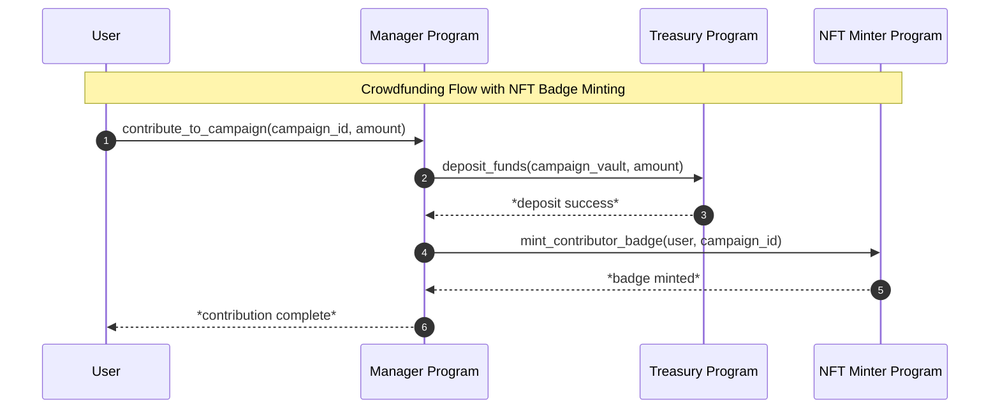
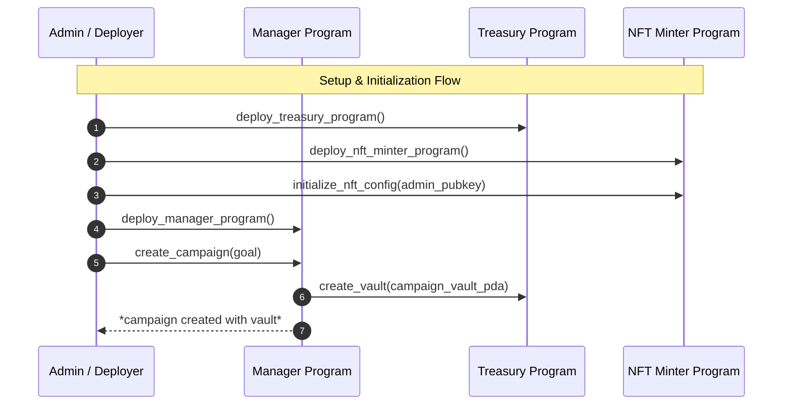

# seer-demo

This is a mock Solana project created to demonstrate how **Seer** can be used for troubleshooting unexpected errors in Solana programs.

## Description

The project includes three Solana programs - **Manager**, **Treasury**, and **NFTMinter** - implementing a simple crowdfunding use case:

- **Admins** create campaigns through the Manager, setting up all configurations.
- **Users** contribute funds via the Treasury and receive an NFT badge from the NFTMinter as proof of contribution.

An intentional bug is introduced in the user flow to showcase how **Seer** can help identify and debug it.

## Crowdfunding Flow

## How to Run
There is a client that runs the admin and user flow in a single transaction.
The admin flow instructions succeed, but the transaction **fails on the user flow** instructions - this failure is intentional for the demonstration purposes.

1. `./build.sh` - to build solana programs
2. `RUSTFLAGS="-A warnings" cargo build --package client` - to build a client
3. `target/debug/client` - to execute the client